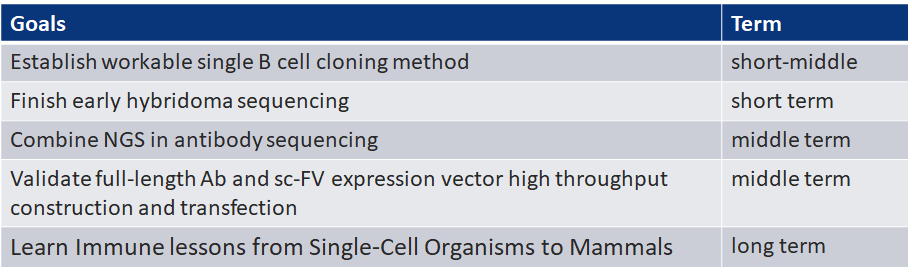

# Review of 2019 & Plan of 2020

### **2019 work plan** **\(written at 20-Dec-2018\)**

1. Establish workable single B cell cloning method： 

   完成了用于SMARTer RACE的配方，使之适用于从单个B细胞到建库的cDNA准备。单次反应成本相比市面试剂盒降低了数十倍，使之适用于高通量。

2. Finish early hybridoma sequencing：
   1. 分别用NGS和一代测序进行了primary screening之后的杂交瘤测序，相比传统的方法通量提高、成本降低。
   2. 一些亚克隆失败的克隆，从早期搜集的杂交瘤细胞中测回抗体序列，并进行表达验证。
3. Combine NGS in antibody sequencing：
   1. 完成了杂交瘤，HcAb文库的NGS测序和分析；
   2. 尝试了从HcAb NGS文库选择抗体进行合成测试
4. Validate full-length Ab and sc-FV expression vector high throughput construction and transfection：
   1. 主要从两条线进行，IVTT和Duo-promoter，无细胞体系主要依赖于康码生物新推出的成本低廉的试剂盒，但到最终确认目前的试剂盒的表达量并不高，实验设计细节经过和厂家技术人员确认没有问题，这个方法走通有赖于无细胞表达技术进一步更新。
   2. Duo-promoter方案，优化了转染条件，从已有的数据来看小量生产抗体的表达量比双质粒\(pTT5\)低2-3倍。
5. Learn Immune lessons from Single-Cell Organisms to Mammals：
   1. 从其他生物的免疫系统进化当中寻找可能的机会，今年主要是在CD79b靶点的评估和对B细胞发育的梳理中深入了解了B细胞相关的生物学知识。希望新一年继续这一主题的了解。

### **2019 tasks** **\(written at 20-Dec-2018\)**

1. target specific memory/plasma B cell sorting： 
   1. 因为上半年停止了单细胞克隆工作，这一块只做了文献梳理，在下边年做了一些Plasma cell培养的尝试。
2. RT、PCR conditions:  
   1. 完成了细节上的条件摸索；
   2. 单个B细胞的扩增成功率需要按照不同的B细胞亚型，做实验予以确认。
3. DNA/RNA high through put：
   1. 虽然没有采购磁珠纯化的机器，目前项目中常见的数十至数百个DNA/RNA纯化，都用磁力架可以解决。
   2. 高通量定量：尝试了可以透过紫外的96孔板，但是对样品量的要求较高，目前其他的DNA定量方法，qPCR和其他试剂盒的方法，都不够简单、便宜。
4. NGS: 如上
5. In-fusion to transfection：优化了重组克隆到转染整个流程。

### 2019小结

在提高早期抗体发现的效率和通量方面，19年做了多项测试，为后期进一步应用打下基础。其中，较为重要的是带有**“指数增长”**特质的技术，包括：

* 单细胞扩增/测序
* 高通量核酸磁珠纯化
* 无细胞蛋白表达
* 高通量测序

这些技术本身正在经历相对快速的更新、迭代：单细胞扩增/测序不断有新方法/配方出现，未来可能会出现特别便宜/成功率特别高的技术；核酸/蛋白磁珠纯化的国产仪器已经在前几年井喷出现，未来会变成基础设施，进一步限制柱式纯化的应用场合；无细胞表达体系可能会挑战现有的CMC和发酵规则，大大降低蛋白产品的批间差；高通量测序的成本/精度改进正继续符合摩尔定律，会成为未来的抗体文库测序/个体免疫表征/精准医疗的基础设施。

#### 有许多问题是做了之后才发现的：

> **高通量核酸纯化：**目前的商用仪器都没能做到直接PCR板纯化，需要转到深孔板之中；而抗体发现过程中，10^3已经是常见的克隆/纯化的上限（受制于鼠B细胞/阳性杂交瘤数目），更高的数目往往说明上下游策略的不成熟。因此，除非有足够智能且支持96孔PCR板的纯化仪器，96孔板磁力架，已经能够满足相应需求。

> **Duo-promoter vector的重要性：** 在CXCL13项目中，采用了pTT5双质粒的方法，每一个杂交瘤在获得重轻链PCR产物之后，同源重组到pTT5中，先做重轻链测序，而后选择unique的重链/轻链质粒转染，将重轻链配对/定转染体积的工作非常麻烦。而Duo-promoter则可以先验证、再测序，每一个阳性克隆已经对应一个重组分子。
>
> 但是这个过程中的**痛点**则是：1. 每一个克隆，需要涂一块平板；2. 克隆，测序，抽质粒，转染这些步骤当中一旦有标记错误，难以追踪。
>
> **Barcode in Duo-promoter vector：**
>
> 在Duo质粒中引入bar-codes，在形成一个表达质粒的同时，带有独一的标记，这样，在转化之前就可以混合送测NGS, 转化的时候也可以混合而后送CRO挑菌落-高通量抽质粒，类似于HcAb目前的筛选流程，但是前期可以借助杂交瘤或者B cell culture进行narrow down。

#### 克隆构建/质粒抽提/转染：

In-house做抗体测序、质粒构建、质粒抽提、转染都可以降低成本，减少时间。其实减少时间作用为主，19年很大的感触就是内部做质粒构建相对不划算。从减少时间的角度，内部从抗体测序，构建，到抽提、转染可以节约非常可观的时间；但全新的构建工作（载体构建，双抗分子构建，定点突变\(确保每一个都完成\)\)，用基因合成一般会好过内部构建：

一方面，做单一构建的时候，因为流程固定，时间上和多个构建一致，不如直接合成；做批量构建的时候，往往会在不同的步骤需要重复/返工，到最后时间和成本可能都不如直接合成。分子工作是很多小块，碎片化的工作会导致难以有整段时间进行项目的规划、实验的计划。新的一年里，减少内部非高通量的克隆、构建工作，在需要争取时间的时候，部分质粒抽提工作放在内部做，因为返工率低，节省时间比例较高。

### 2020年计划

1️⃣完成Duo质粒的优化


1. 同时包括对一些元件的筛选，得到高表达能力的质粒。
2. 将这些元件模块化，得到一个表达质粒的set


2️⃣设计并构建应用于CHO的稳转质粒，并优化从顺转质粒到稳转质粒的切换，使得在早期验证挑选之后，很快切换成稳转CHO的Pool，加快leads稳转株的构建。

3️⃣基于NGS的抗体发现：

> SPLIT-Seq： 借助SPLIT-Seq进行H2L2的抗体文库测序和抗体发现。（经讨论是否做）
>
> A

